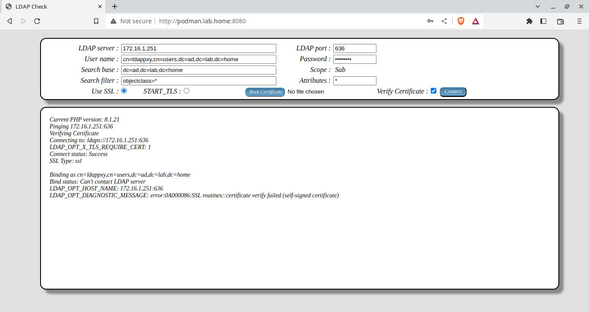

# php_ldapchk

## Description

PHP script to check an LDAP connection. It has the ability to toggle certificate verification on and off. It also allows for a root certificate to be uploaded to be added to the verification chain.

The certificate verification is hit-and-miss. I think it is that once a connection is made, it is continuing to use those settings and ignoring the change to certificate verify.

The PHP options to turn off certificate verification are:
```
ldap_set_option(null, LDAP_OPT_X_TLS_CACERTFILE, "");
ldap_set_option(null, LDAP_OPT_X_TLS_CACERTDIR, "/tmp");
ldap_set_option(null, LDAP_OPT_X_TLS_REQUIRE_CERT, LDAP_OPT_X_TLS_NEVER);
```

The PHP options to turn on certificate verification are:
```
ldap_set_option(null, LDAP_OPT_X_TLS_CACERTFILE, "");
ldap_set_option(null, LDAP_OPT_X_TLS_CACERTDIR, "/tmp");
ldap_set_option(null, LDAP_OPT_X_TLS_REQUIRE_CERT, LDAP_OPT_X_TLS_HARD);
```

The PHP options to turn on certificate verification with the uploaded root certificate:
```
ldap_set_option(null, LDAP_OPT_X_TLS_CACERTFILE, $_FILES['rootcert']['tmp_name']);
ldap_set_option(null, LDAP_OPT_X_TLS_CACERTDIR, "/tmp");
ldap_set_option(null, LDAP_OPT_X_TLS_REQUIRE_CERT, LDAP_OPT_X_TLS_HARD);
```

## Usage

> Note that all these examples expose the complete git repository. It is not designed to be internet facing.

1. Simply copy the index.php to an existing PHP capable web server. It requires the ***php-ldap*** package.

```
cd /var/www/html
git clone https://github.com/naebrae/php_ldapchk.git ldapchk
```
```
curl http://localhost/ldapchk
```

2. Docker or Podman

> Note: this example doesn't release the terminal. Add -dt to the run command to detach the terminal and run in the background.
> This maps the local folder in to the docker container so that the file can be edited with out having to rebuild or restart the container.

```
git clone https://github.com/naebrae/php_ldapchk.git ldapchk
cd ldapchk
podman build -t ldapchk .
podman run -p 1080:80 -p 1443:443 -v .:/var/www/html localhost/ldapchk
```
```
curl http://localhost:1080
```

3. Docker-compose

> Note: this example doesn't release the terminal. Add -d to the up command to detach the terminal and run in the background.
> This maps the local folder in to the docker container so that the file can be edited with out having to rebuild or restart the container.

```
git clone https://github.com/naebrae/php_ldapchk.git ldapchk
cd ldapchk
sudo docker-compose build
sudo docker-compose up
```
```
curl http://localhost:1080
```

## Screenshots

Connections to Samba AD example machine from https://github.com/naebrae/ansible_auth

> The Samba AD machines have self-signed certificates so should fail certificate verification.

### 1. Base scope using ldappxy account, not verifying the certificate. Returning all (*) attributes. Using implicit ssl connection (implied by the port).


### 2. Sub-tree scope using Anonymous account, not verifying the certificate. Returning all (*) attributes. Using implicit ssl connection (implied by the port).


### 3. Sub-tree scope using ldappxy account but missing password, not verifying the certificate. Using explicit ssl connection (explicitly requested using START_TLS to non-secure port). Expected to return 'Invalid credentials'.


### 4. Sub-tree scope using ldappxy account but verifying certificate. Using implicit ssl connection (implied by the port). Expected to fail with self-signed certificate.
> Note the bind status: "Can't contact LDAP server"



### 5. Sub-tree scope using ldappxy account but verifying certificate. Using explicit ssl connection (explicitly requested using START_TLS to non-secure port). Expected to fail with self-signed certificate.
> Note the bind status: "Can't contact LDAP server"


### 6. Base scope using ldappxy account, not verifying certificate. Returning no attributes. Using explicit ssl connection (explicitly requested using START_TLS to non-secure port). Expected to be successful.


### 7. One level scope using Anonymous account, not verifying certificate. Returning no attributes and missing search filter. Using explicit ssl connection (explicitly requested using START_TLS to non-secure port). Expected to fail.
> Note the bind status: Success but Search status: "Can't contact LDAP server"


### 8. One level scope using Anonymous account, not verifying certificate. Returning no attributes with a search filter. Using explicit ssl connection (explicitly requested using START_TLS to non-secure port). Expected to be successful.


### 9. One level scope using Anonymous account, not verifying certificate. Returning only the cn and mail attributes (dn is always returned) with a search filter. Using explicit ssl connection (explicitly requested using START_TLS to non-secure port). Expected to be successful.


